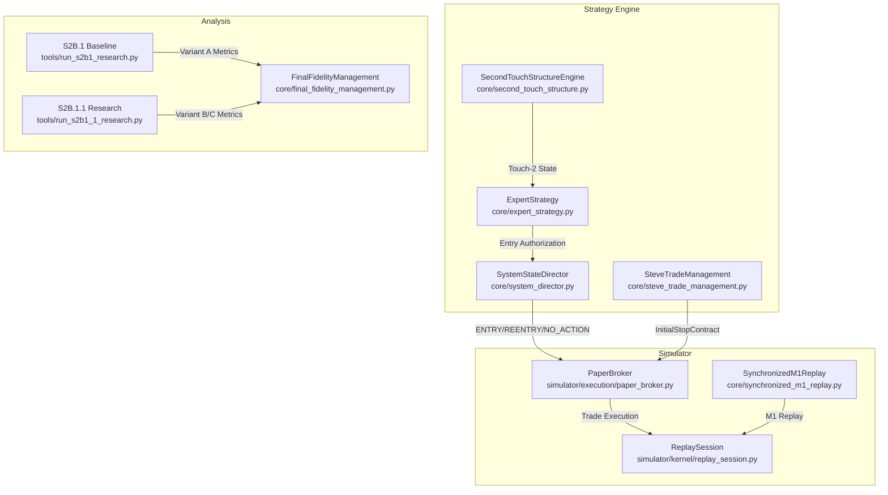
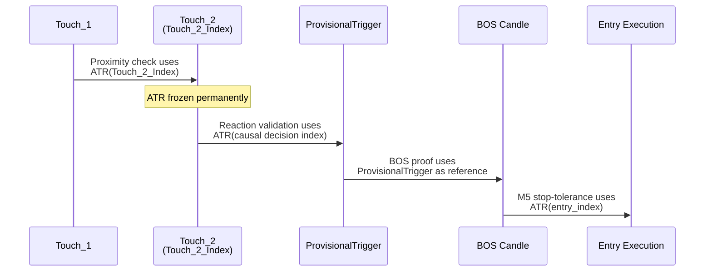
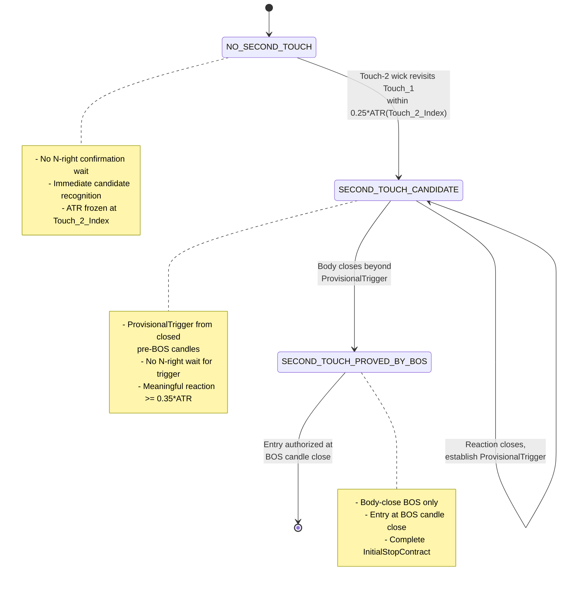
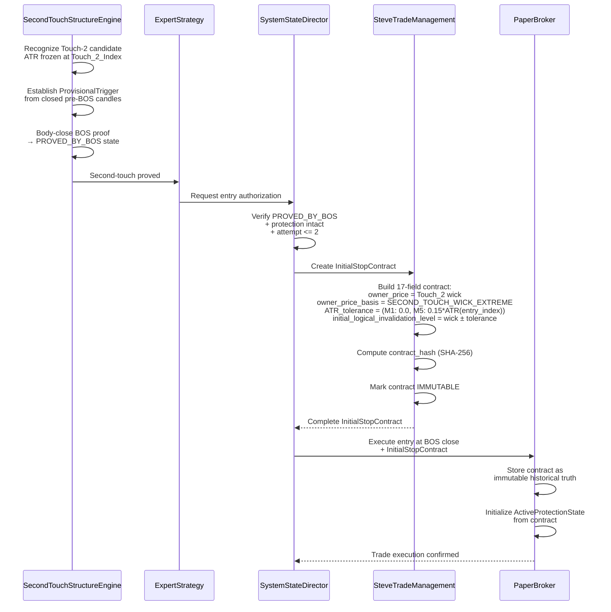
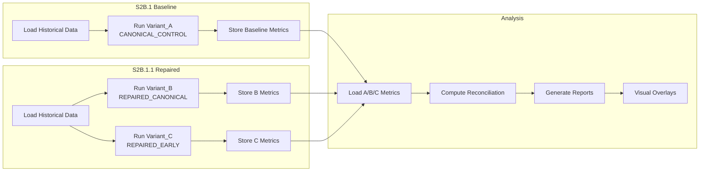

# Design Document: S2B.1.1 Contract Integrity Repair

## Overview

S2B.1.1 repairs causal timing/confirmation-latency and contract-integrity defects introduced by S2B.1's architecture while preserving suffix invariance and causality. The core repairs address:

1. **Touch-2 Recognition Latency**: S2B.1 required N-right confirmation for Touch-2 candidates, delaying recognition unnecessarily. S2B.1.1 recognizes Touch-2 candidates immediately when the wick closes, using causal ATR clocks frozen at Touch_2_Index.

2. **Contract Incompleteness**: S2B.1 left InitialStopContract incomplete, forcing PaperSimulator to reconstruct stop semantics with potential future-data access and historical inaccuracy. S2B.1.1 creates complete immutable InitialStopContract with SECOND_TOUCH_WICK_EXTREME semantic routing.

3. **Causal ATR Clock Violations**: S2B.1 risked measuring Touch-Proximity ATR at Available_At_Index instead of Touch_2_Index. S2B.1.1 enforces causal ATR clocks: Touch-Proximity ATR measured at Touch_2_Index, M5 stop-tolerance ATR measured at entry_index.

The repairs are research-only: no live broker APIs, no demo order submission, no production trading changes. Scope is strictly automated second-touch recognition timing, stop contract completeness, and metrics reconciliation for paper-only research comparison.

### S2B.1.1 Execution Variants

- **Variant_A (CANONICAL_CONTROL)**: Pre-S2B.1.1 baseline using permission=COUNTER_CONFIRMED_ACTIVE with N-right Touch-2 confirmation
- **Variant_B (REPAIRED_SECOND_TOUCH_CANONICAL)**: Repaired logic with permission=COUNTER_CONFIRMED_ACTIVE, immediate Touch-2 candidate recognition, causal ATR clocks, ProvisionalTrigger, body-close BOS proof
- **Variant_C (REPAIRED_SECOND_TOUCH_EARNED_EARLY)**: Identical to Variant_B except permission=EARNED_EARLY_OR_COUNTER_CONFIRMED_ACTIVE
- **MANUAL_SHADOW**: Audit/visual evidence using manually provided anchors, NEVER an execution variant, isolated from automated logic

## Architecture

### System Components




### Component Responsibilities


#### SecondTouchStructureEngine (core/second_touch_structure.py)

Automated recognition of second-touch patterns with repaired timing:

- **Touch-2 Candidate Recognition**: Immediate recognition when swing wick revisits Touch_1 level within proximity tolerance
- **Causal ATR Clock**: Measures Touch-Proximity ATR at Touch_2_Index (actual swing index), freezes permanently
- **ProvisionalTrigger Derivation**: Monitors post-Touch-2 reactions from closed pre-BOS candles
- **Body-Close BOS Proof**: Recognizes body-close break beyond ProvisionalTrigger as SECOND_TOUCH_PROVED_BY_BOS
- **State Transitions**: NO_SECOND_TOUCH → SECOND_TOUCH_CANDIDATE → SECOND_TOUCH_PROVED_BY_BOS

#### ExpertStrategy (core/expert_strategy.py)

Orchestrates strategy logic and entry authorization:

- Receives second-touch state from SecondTouchStructureEngine
- Evaluates entry conditions when SECOND_TOUCH_PROVED_BY_BOS state achieved
- Routes authorization requests to SystemStateDirector

#### SteveTradeManagement (core/steve_trade_management.py)

Creates complete immutable InitialStopContract:

- **select_setup_logical_invalidation()**: MUST CONSUME contract, not recompute body edges
- Creates 17 required + 1 optional field InitialStopContract
- Sets owner_price_basis = "SECOND_TOUCH_WICK_EXTREME"
- Applies M1/M5-specific invalidation rules:
  - M1: ATR_tolerance = 0.0, initial_logical_invalidation_level = owner_price (exact wick)
  - M5 BUY: ATR_tolerance = 0.15 * ATR(entry_index), initial_logical_invalidation_level = owner_price - ATR_tolerance
  - M5 SELL: ATR_tolerance = 0.15 * ATR(entry_index), initial_logical_invalidation_level = owner_price + ATR_tolerance


#### SystemStateDirector (core/system_director.py)

Final strategy action authority:

- Makes ENTRY/REENTRY/NO_ACTION decisions
- Enforces maximum one first attempt plus maximum one fresh-structure re-entry per setup
- Requires SECOND_TOUCH_PROVED_BY_BOS state before entry authorization
- Respects protection-intact and setup-not-consumed requirements

#### PaperBroker (simulator/execution/paper_broker.py)

Historical simulator execution:

- **CONSUMES InitialStopContract** without reconstruction
- Executes trades using closed-candle data only
- Maintains ActiveProtectionState as separate mutable boundary
- Enforces direction-aware protection (never loosens to increase risk)
- Records entry at BOS candle close price

#### ReplaySession (simulator/kernel/replay_session.py)

Replay kernel orchestration:

- Manages historical data replay
- Coordinates M1/M5 timeframe synchronization
- Provides closed-candle data to strategy and simulator

#### SynchronizedM1Replay (core/synchronized_m1_replay.py)

M1 replay coordination for second-touch patterns requiring M1 precision.

#### FinalFidelityManagement (core/final_fidelity_management.py)

Metrics reconciliation and analysis.


### Causal ATR Clock Architecture

S2B.1.1 enforces strict causal ATR clocks to prevent future-data access:

1. **Touch-Proximity ATR**: Measured at Touch_2_Index (actual swing index where Touch-2 wick formed)
   - Used for: abs(Touch_2.price - Touch_1.price) <= 0.25 * Touch-Proximity ATR
   - Frozen permanently for that Touch-2 candidate
   - NEVER uses Available_At_Index

2. **ProvisionalTrigger ATR**: Measured at causal decision index from closed pre-BOS candles
   - Used for: meaningful reaction validation (>= 0.35 * causal ATR)
   - Establishes BOS invalidation reference

3. **M5 Stop-Tolerance ATR**: Measured at entry_index (verified actual implementation)
   - Code evidence: `atr_value = atr_at(data, as_of_index=entry_index)` in select_setup_logical_invalidation() line 295
   - Used for: M5 ATR_tolerance = 0.15 * ATR(entry_index)
   - Applied to initial_logical_invalidation_level calculation




## Components and Interfaces

### InitialStopContract Schema

Complete immutable contract created at entry authorization with 17 required + 1 optional fields:

```python
InitialStopContract = {
    # Identity
    "contract_id": str,              # Unique identifier
    "contract_version": str,         # Schema version
    
    # Owner Identity
    "owner_type": str,               # "SECOND_TOUCH_WICK"
    "owner_index": int,              # Touch_2_Index
    "owner_time": datetime,          # Touch_2 timestamp
    "owner_price": float,            # Touch_2 exact wick price
    "owner_price_basis": str,        # "SECOND_TOUCH_WICK_EXTREME"
    
    # Context
    "timeframe": str,                # "M1" or "M5"
    "direction": str,                # "BUY" or "SELL"
    
    # Invalidation Geometry
    "logical_structure_level": float,              # Touch_2 exact wick (= owner_price)
    "initial_logical_invalidation_level": float,   # M1: wick exact, M5: wick ± ATR_tolerance
    "ATR_tolerance": float,                        # 0.0 for M1, 0.15*ATR(entry_index) for M5
    "emergency_stop": float,                       # Emergency boundary from existing code
    "invalidation_semantics": str,                 # "M1_EXACT_WICK" or "M5_ATR_TOLERANT"
    
    # Lineage
    "setup_id": str,                 # Parent setup identifier
    "retracement_id": str,           # Retracement identifier
    "attempt_number": int,           # 1 or 2
    
    # Integrity (optional)
    "contract_hash": Optional[str],  # SHA-256 hash of contract content
}
```


### M1/M5 Invalidation Rules

#### M1 Exact-Wick Invalidation

```python
# M1 Configuration
ATR_tolerance = 0.0
logical_structure_level = Touch_2_exact_wick
initial_logical_invalidation_level = Touch_2_exact_wick  # No tolerance

# M1 Invalidation Logic
# Wick excursion beyond Touch_2_exact_wick: survives (acceptable)
# Body close beyond Touch_2_exact_wick: INVALIDATES setup
```

#### M5 ATR-Tolerant Invalidation

```python
# M5 Configuration
ATR_tolerance = 0.15 * ATR(entry_index)  # Measured at entry_index
logical_structure_level = Touch_2_exact_wick

# M5 BUY/BULLISH
initial_logical_invalidation_level = Touch_2_exact_wick - ATR_tolerance
# Body close below this level: INVALIDATES

# M5 SELL/BEARISH
initial_logical_invalidation_level = Touch_2_exact_wick + ATR_tolerance
# Body close above this level: INVALIDATES
```

### SecondTouchStructureEngine Interface

```python
class SecondTouchStructureEngine:
    def update_second_touch_state(
        self,
        closed_candles: List[Candle],
        current_index: int
    ) -> SecondTouchState:
        """
        Updates second-touch recognition state using repaired timing logic.
        
        Returns SecondTouchState with:
        - state: NO_SECOND_TOUCH | SECOND_TOUCH_CANDIDATE | SECOND_TOUCH_PROVED_BY_BOS
        - touch_2_index: Touch_2_Index (actual swing index)
        - touch_proximity_atr: ATR frozen at Touch_2_Index
        - provisional_trigger: Post-Touch-2 reaction from closed pre-BOS candles
        - bos_proof_index: Index where body-close BOS occurred
        """
```


### SteveTradeManagement Interface

```python
class SteveTradeManagement:
    def select_setup_logical_invalidation(
        self,
        contract: InitialStopContract,  # MUST consume, not recompute
        market_data: MarketData,
        entry_index: int
    ) -> float:
        """
        Consumes InitialStopContract to determine invalidation level.
        MUST NOT recompute body edges or reconstruct semantics.
        
        For M5 second-touch:
        - Reads contract.ATR_tolerance (already computed as 0.15 * ATR(entry_index))
        - Reads contract.initial_logical_invalidation_level
        - Returns appropriate boundary based on direction
        """
```

### SystemStateDirector Interface

```python
class SystemStateDirector:
    def make_strategy_decision(
        self,
        second_touch_state: SecondTouchState,
        protection_state: ProtectionState,
        setup_state: SetupState
    ) -> StrategyAction:
        """
        Final authority for ENTRY/REENTRY/NO_ACTION decisions.
        
        Entry requirements:
        - second_touch_state.state == SECOND_TOUCH_PROVED_BY_BOS
        - protection_state.is_intact == True
        - setup_state.consumed == False
        - attempt_number <= 2
        """
```


### PaperBroker Interface

```python
class PaperBroker:
    def execute_entry(
        self,
        initial_stop_contract: InitialStopContract,
        entry_price: float,
        entry_time: datetime,
        entry_index: int
    ) -> TradeExecution:
        """
        Executes entry using complete immutable InitialStopContract.
        CONSUMES contract without reconstruction.
        
        - Stores InitialStopContract as immutable historical truth
        - Initializes ActiveProtectionState from contract
        - Applies direction-aware protection updates (never loosens)
        - Records all state transitions
        """
    
    def update_protection(
        self,
        trade_id: str,
        new_protection_level: float,
        current_price: float,
        direction: str
    ) -> bool:
        """
        Updates ActiveProtectionState with direction-aware rules.
        
        BUY: new_protection_level >= current_protection_level (upward/hold only)
        SELL: new_protection_level <= current_protection_level (downward/hold only)
        
        Returns False if update would loosen protection (increase risk).
        """
```

## Data Models

### SecondTouchState

```python
@dataclass
class SecondTouchState:
    state: Literal["NO_SECOND_TOUCH", "SECOND_TOUCH_CANDIDATE", "SECOND_TOUCH_PROVED_BY_BOS"]
    touch_1_index: Optional[int]
    touch_1_price: Optional[float]
    touch_2_index: Optional[int]  # Touch_2_Index (actual swing index)
    touch_2_price: Optional[float]
    touch_proximity_atr: Optional[float]  # ATR frozen at Touch_2_Index
    provisional_trigger_index: Optional[int]
    provisional_trigger_price: Optional[float]
    bos_proof_index: Optional[int]
    bos_proof_price: Optional[float]
```


### ProtectionState

```python
@dataclass
class ProtectionState:
    is_intact: bool
    initial_stop_contract: InitialStopContract  # Immutable historical truth
    active_protection_level: float  # Mutable current boundary
    protection_history: List[ProtectionUpdate]  # All tightening events
```

### SetupState

```python
@dataclass
class SetupState:
    setup_id: str
    consumed: bool
    attempt_number: int  # 1 or 2
    retracement_id: str
```

### StrategyAction

```python
@dataclass
class StrategyAction:
    decision: Literal["ENTRY", "REENTRY", "NO_ACTION"]
    reasoning: str
    second_touch_state: SecondTouchState
    initial_stop_contract: Optional[InitialStopContract]
```

## Correctness Properties

*A property is a characteristic or behavior that should hold true across all valid executions of a system—essentially, a formal statement about what the system should do. Properties serve as the bridge between human-readable specifications and machine-verifiable correctness guarantees.*


**Property-Based Testing Assessment**: S2B.1.1 is primarily an infrastructure/simulator repair involving state management, contract creation, historical replay, and causality preservation. These characteristics make it unsuitable for property-based testing. The feature requires deterministic example-based unit tests, integration tests, replay tests, and causality tests using controlled timelines.

**No Correctness Properties section is included**. Testing strategy uses existing pytest architecture without adding Hypothesis or other PBT dependencies.

## Error Handling

### Touch-2 Recognition Errors

**Invalid Proximity**: Touch_2 candidate violates abs(Touch_2 - Touch_1) > 0.25 * Touch-Proximity ATR
- Action: Reject candidate, remain in NO_SECOND_TOUCH state
- Log: "Touch-2 candidate rejected: proximity violation"

**Insufficient Separation**: Fewer than 3 bars between Touch_1 and Touch_2
- Action: Reject candidate, remain in NO_SECOND_TOUCH state
- Log: "Touch-2 candidate rejected: insufficient separation"

**Weak Separating Reaction**: abs(reaction.price - Touch_1.price) < 0.35 * causal ATR
- Action: Reject candidate, remain in NO_SECOND_TOUCH state
- Log: "Touch-2 candidate rejected: weak separating reaction"

### BOS Proof Errors

**Wick-Only BOS**: Wick breaks ProvisionalTrigger but body does not close beyond it
- Action: Reject BOS proof, remain in SECOND_TOUCH_CANDIDATE state
- Log: "BOS rejected: wick-only break, body did not close beyond ProvisionalTrigger"

**No ProvisionalTrigger**: BOS evaluation attempted before ProvisionalTrigger established
- Action: Defer BOS evaluation, remain in SECOND_TOUCH_CANDIDATE state
- Log: "BOS evaluation deferred: ProvisionalTrigger not yet established"


### InitialStopContract Errors

**Incomplete Contract**: Missing required fields from 17-field schema
- Action: Reject entry authorization, raise ContractIncompleteError
- Log: "InitialStopContract creation failed: missing required fields {field_names}"

**Invalid ATR Tolerance**: M1 with non-zero ATR_tolerance, or M5 with ATR_tolerance != 0.15 * ATR(entry_index)
- Action: Reject contract, raise InvalidATRToleranceError
- Log: "InitialStopContract validation failed: invalid ATR_tolerance for timeframe {timeframe}"

**Invalid Invalidation Level**: M5 BUY with initial_logical_invalidation_level != owner_price - ATR_tolerance, or M5 SELL with initial_logical_invalidation_level != owner_price + ATR_tolerance
- Action: Reject contract, raise InvalidInvalidationLevelError
- Log: "InitialStopContract validation failed: invalidation level does not match specification"

**Contract Mutation Attempt**: Code attempts to modify InitialStopContract after creation
- Action: Raise ImmutableContractError
- Log: "Contract mutation blocked: InitialStopContract is immutable"

### SystemStateDirector Errors

**Premature Entry**: Entry requested before SECOND_TOUCH_PROVED_BY_BOS state
- Action: Return NO_ACTION decision
- Log: "Entry denied: second-touch not yet proved by BOS"

**Attempt Limit Exceeded**: Entry requested when attempt_number > 2
- Action: Return NO_ACTION decision
- Log: "Entry denied: attempt limit exceeded for setup {setup_id}"

**Protection Violated**: Entry requested when protection_state.is_intact == False
- Action: Return NO_ACTION decision
- Log: "Entry denied: protection violated for setup {setup_id}"


### Suffix Invariance Errors

**Future Data Access Detected**: Decision at timestamp T uses data from timestamp T+n
- Action: Raise SuffixInvarianceViolationError
- Log: "Causality violation: future data accessed at timestamp {T}"

**Decision Inconsistency**: Same timestamp T produces different decisions across different timelines
- Action: Raise SuffixInvarianceViolationError
- Log: "Causality violation: decision at timestamp {T} varies across timelines"

### PaperBroker Errors

**Contract Reconstruction Attempt**: PaperBroker attempts to recompute stop semantics instead of consuming InitialStopContract
- Action: Raise ContractReconstructionError
- Log: "Contract reconstruction blocked: PaperBroker must consume InitialStopContract"

**Protection Loosening**: Attempt to update ActiveProtectionState in direction that increases risk
- Action: Reject protection update, return False
- Log: "Protection update rejected: direction={direction}, would loosen from {current} to {proposed}"

## Testing Strategy

S2B.1.1 requires comprehensive deterministic testing using existing pytest architecture. No property-based testing dependencies are added.

### 1. Exact Deterministic Unit Tests

**Touch-2 Recognition Geometry**:
- Touch_2_Index ATR clock (not Available_At_Index)
- 0.25 ATR proximity validation
- 0.35 ATR meaningful reaction threshold
- Minimum 3-bar separation
- BULLISH reaction uses HIGH wick
- BEARISH reaction uses LOW wick

**BOS Proof Logic**:
- Wick-only BOS rejection (body must close beyond ProvisionalTrigger)
- BOS candle cannot create its own ProvisionalTrigger
- Entry timing at BOS candle close


### 2. Exact Stop-Contract Regression Tests

**SECOND_TOUCH_WICK_EXTREME Preservation**:
- Bearish Touch-2 HIGH wick never becomes body edge
- Bullish Touch-2 LOW wick never becomes body edge
- M1 exact-wick semantics (ATR_tolerance = 0.0)
- M5 ATR-tolerant semantics (ATR_tolerance = 0.15 * ATR(entry_index))
- InitialStopContract immutability

**Contract Field Validation**:
- All 17 required fields present
- owner_price_basis = "SECOND_TOUCH_WICK_EXTREME"
- M5 BUY: initial_logical_invalidation_level = owner_price - ATR_tolerance
- M5 SELL: initial_logical_invalidation_level = owner_price + ATR_tolerance
- contract_hash matches content SHA-256

### 3. End-to-End Integration Tests

**Full Pipeline**:
```
SecondTouchStructureEngine
  → ExpertStrategy
    → SystemStateDirector
      → InitialStopContract creation
        → Synchronized M1 replay
          → FinalFidelityManagement
            → PaperBroker execution
              → Replay ledger
                → Audit/visual output
```

**Integration Checkpoints**:
- SecondTouchStructureEngine state transitions
- ExpertStrategy entry authorization
- SystemStateDirector ENTRY/REENTRY/NO_ACTION decisions
- InitialStopContract completeness and immutability
- PaperBroker contract consumption without reconstruction
- ActiveProtectionState direction-aware updates


### 4. Suffix-Invariance Tests Using Controlled Timelines

**Test Structure**: For each critical decision timestamp T, verify identical decisions across:
- Timeline A: prefix ending at T
- Timeline B: same prefix + actual future
- Timeline C: same prefix + modified future
- Timeline D: same prefix + reversal future

**Invariant Decisions at Timestamp T**:
- Touch-2 candidate identity
- Touch-Proximity ATR value
- Touch-Proximity ATR source index (must be Touch_2_Index)
- ProvisionalTrigger identity and level
- SECOND_TOUCH_PROVED_BY_BOS state
- Entry readiness
- Entry price
- InitialStopContract fields
- Owner identity (setup_id, retracement_id, attempt_number)
- SystemDirector final decision

**Mutable Post-T Decisions** (allowed to differ across timelines):
- ActiveProtectionState updates after entry
- Trailing stop adjustments
- Exit timing and price
- Trade P&L

### 5. Re-Entry Lifecycle Tests

**First Attempt Immutability**:
- InitialStopContract for Attempt 1 never modified
- Attempt 1 stop invalidation does not alter historical contract

**Re-Entry Authorization**:
- Maximum one re-entry per setup (Attempt 2)
- Attempt 2 requires fresh qualified structure
- Parent setup and protection must remain valid
- SystemStateDirector enforces final authority


### 6. Four Deterministic Manual Reconstruction Cases

Each case provides manually anchored Touch_1, Touch_2, ProvisionalTrigger, and EntryBOS events to audit automated recognition:

#### Case 1: AUDUSD# Bearish PB_2121
- **Type**: Double-top (bearish)
- **Manual Touch_1**: [timestamp, price, index]
- **Manual Touch_2**: [timestamp, price, index]
- **Manual ProvisionalTrigger**: [timestamp, price, index]
- **Manual EntryBOS**: [timestamp, price, index]
- **Expected Outcomes**:
  - Automated Touch-2 recognition vs manual anchor
  - Touch-Proximity ATR source = Touch_2_Index
  - ProvisionalTrigger derivation from closed pre-BOS candles
  - Body-close BOS proof timing
  - InitialStopContract SECOND_TOUCH_WICK_EXTREME with Touch_2 HIGH wick
  - Entry timing: BOS candle close
  - Latency comparison: S2B.1.1 vs S2B.1 (N-right confirmation delay)

#### Case 2: USDJPY# Bearish PB_1538
- **Type**: Double-top (bearish)
- **Manual Touch_1**: [timestamp, price, index]
- **Manual Touch_2**: [timestamp, price, index]
- **Manual ProvisionalTrigger**: [timestamp, price, index]
- **Manual EntryBOS**: [timestamp, price, index]
- **Expected Outcomes**: Same structure as Case 1

#### Case 3: GER40Cash# Bearish PB_2066
- **Type**: Double-top (bearish)
- **Manual Touch_1**: [timestamp, price, index]
- **Manual Touch_2**: [timestamp, price, index]
- **Manual ProvisionalTrigger**: [timestamp, price, index]
- **Manual EntryBOS**: [timestamp, price, index]
- **Expected Outcomes**: Same structure as Case 1


#### Case 4: GER40Cash# Bullish PB_2365
- **Type**: Double-bottom (bullish)
- **Manual Touch_1**: [timestamp, price, index]
- **Manual Touch_2**: [timestamp, price, index]
- **Manual ProvisionalTrigger**: [timestamp, price, index]
- **Manual EntryBOS**: [timestamp, price, index]
- **Expected Outcomes**:
  - Automated Touch-2 recognition vs manual anchor
  - Touch-Proximity ATR source = Touch_2_Index
  - ProvisionalTrigger derivation from closed pre-BOS candles
  - Body-close BOS proof timing
  - InitialStopContract SECOND_TOUCH_WICK_EXTREME with Touch_2 LOW wick
  - Entry timing: BOS candle close
  - Latency comparison: S2B.1.1 vs S2B.1 (N-right confirmation delay)

**Reconstruction Report Format**:
```
Manual Reconstruction Report: {symbol} {setup_id}
========================================

Touch_1:
  Manual: {timestamp, price, index}
  Automated: {timestamp, price, index}
  Match: {YES/NO}

Touch_2:
  Manual: {timestamp, price, index}
  Automated: {timestamp, price, index}
  Touch-Proximity ATR: {value} at index {Touch_2_Index}
  Proximity Check: abs({Touch_2} - {Touch_1}) = {diff} <= 0.25 * {ATR} = {threshold}
  Match: {YES/NO}

ProvisionalTrigger:
  Manual: {timestamp, price, index}
  Automated: {timestamp, price, index}
  Reaction Magnitude: {value} >= 0.35 * {ATR}
  Match: {YES/NO}

EntryBOS:
  Manual: {timestamp, price, index}
  Automated: {timestamp, price, index}
  BOS Type: {body-close / wick-only}
  Match: {YES/NO}

InitialStopContract:
  owner_price_basis: SECOND_TOUCH_WICK_EXTREME
  owner_price: {Touch_2 wick}
  logical_structure_level: {Touch_2 wick}
  initial_logical_invalidation_level: {M1: exact wick, M5: wick ± ATR_tolerance}
  ATR_tolerance: {0.0 for M1, 0.15*ATR(entry_index) for M5}

Latency Analysis:
  S2B.1 Recognition: {timestamp} (N-right confirmation)
  S2B.1.1 Recognition: {timestamp} (immediate candidate)
  Latency Reduction: {delta}
```


### 7. Infrastructure and Regression Checks

**Clean Checkout Tests**:
- All test fixtures stored in version-controlled paths
- Identical test results on clean git clone
- No dependency on gitignored artifacts
- No dependency on research_runs/s2b1/research_data_before.json

**Workspace Isolation**:
- No sibling Codex workspace dependency
- No imports from ../Codex/ or similar external directories
- All code and configuration sourced from current workspace
- All tests execute using only current workspace resources

**Research Data Immutability**:
- BEFORE_HASH = SHA-256 of research_data/ tree before S2B.1.1
- AFTER_HASH = SHA-256 of research_data/ tree after S2B.1.1
- Verification: BEFORE_HASH == AFTER_HASH
- New S2B.1.1 outputs isolated to research_runs/s2b1_1/ directory

**Inherited Test Suite**:
- All inherited strategy tests pass
- All inherited simulator tests pass
- Zero regressions across existing functionality

**Order API Verification**:
- Zero live broker order API invocations
- Zero demo broker order API invocations
- No new order submission API functions added
- No existing order submission API functions modified

### Test Organization

```
tests/
├── unit/
│   ├── test_touch2_recognition.py          # Touch-2 geometry, ATR clocks
│   ├── test_bos_proof.py                    # BOS body-close validation
│   ├── test_stop_contract_creation.py       # InitialStopContract schema
│   └── test_direction_aware_protection.py   # ActiveProtectionState updates
├── integration/
│   ├── test_s2b1_1_pipeline.py              # End-to-end SecondTouch → PaperBroker
│   ├── test_suffix_invariance.py            # Controlled timeline tests
│   └── test_reentry_lifecycle.py            # Attempt 1/2 immutability
├── reconstruction/
│   ├── test_audusd_pb2121.py                # Case 1: AUDUSD# bearish
│   ├── test_usdjpy_pb1538.py                # Case 2: USDJPY# bearish
│   ├── test_ger40_pb2066.py                 # Case 3: GER40Cash# bearish
│   └── test_ger40_pb2365.py                 # Case 4: GER40Cash# bullish
└── regression/
    ├── test_clean_checkout.py               # Fixture portability
    ├── test_research_data_integrity.py      # SHA-256 hash verification
    ├── test_workspace_isolation.py          # No external dependencies
    └── test_order_api_zero_usage.py         # No live/demo API calls
```


## Implementation Details

### Repaired Second-Touch Recognition Flow




### InitialStopContract Creation Sequence




### Direction-Aware Protection Updates

```python
def update_active_protection(
    trade_id: str,
    direction: str,
    current_protection: float,
    proposed_protection: float,
    current_price: float
) -> Tuple[bool, float, str]:
    """
    Updates ActiveProtectionState with direction-aware rules.
    Returns (accepted: bool, final_level: float, reason: str)
    """
    
    if direction == "BUY":
        # BUY: protection may move upward (tighten) or hold
        # NEVER move downward (loosen = increase risk)
        if proposed_protection >= current_protection:
            return (True, proposed_protection, "Protection tightened or held")
        else:
            return (False, current_protection, "Protection loosening rejected for BUY")
    
    elif direction == "SELL":
        # SELL: protection may move downward (tighten) or hold
        # NEVER move upward (loosen = increase risk)
        if proposed_protection <= current_protection:
            return (True, proposed_protection, "Protection tightened or held")
        else:
            return (False, current_protection, "Protection loosening rejected for SELL")
    
    else:
        raise ValueError(f"Invalid direction: {direction}")
```

### Suffix Invariance Verification

```python
def verify_suffix_invariance(
    decision_timestamp: datetime,
    prefix_data: List[Candle],
    future_scenarios: List[List[Candle]]
) -> bool:
    """
    Verifies that decisions at timestamp T remain identical
    across different future timelines.
    
    Args:
        decision_timestamp: The timestamp T where decision is made
        prefix_data: Historical data up to and including timestamp T
        future_scenarios: Different possible futures after timestamp T
    
    Returns:
        True if all decisions at T are identical across scenarios
    """
    
    reference_decision = None
    
    for scenario_future in future_scenarios:
        # Combine prefix with this scenario's future
        full_timeline = prefix_data + scenario_future
        
        # Make decision at timestamp T using only prefix_data
        decision = make_decision_at_timestamp(
            timeline=full_timeline,
            decision_time=decision_timestamp,
            use_only_closed_before=decision_timestamp
        )
        
        if reference_decision is None:
            reference_decision = decision
        else:
            # Verify this decision matches reference
            if not decisions_equal(decision, reference_decision):
                return False  # Suffix invariance violated
    
    return True  # All decisions at T are identical
```


## Variant A/B/C Metrics and Reconciliation

### Full Metrics Per Variant

Each execution variant produces comprehensive metrics:

#### Event Metrics
- **total_events**: Total second-touch opportunities detected
- **unique_parent_setups**: Count of distinct parent setups
- **proved_second_touch_parents**: Setups reaching SECOND_TOUCH_PROVED_BY_BOS
- **double_tops**: Bearish second-touch patterns
- **double_bottoms**: Bullish second-touch patterns
- **trigger_supersessions**: ProvisionalTrigger replacements before BOS

#### Entry Metrics
- **first_entry_facts_changed**: Attempt 1 entries with timing/price differences vs baseline
- **re_entry_facts_changed**: Attempt 2 entries with differences vs baseline
- **unchanged_affected_parents**: Setups with unchanged entry facts
- **terminal_population_differences**: Final trade count variance from baseline
- **m1_entry_count**: Entries on M1 timeframe
- **m5_entry_count**: Entries on M5 timeframe

#### Timing and Stop Metrics
- **entry_time_delta**: Mean/median/max time difference from baseline (seconds)
- **stop_distance_delta**: Mean/median/max stop distance difference from baseline (R-multiple)

#### Performance Metrics (per trade)
- **MFE_R**: Maximum Favorable Excursion in R-multiples
- **MAE_R**: Maximum Adverse Excursion in R-multiples
- **peak_R**: Peak unrealized profit in R-multiples
- **final_R**: Realized profit/loss in R-multiples
- **giveback_R**: Peak_R - Final_R (profit given back before exit)

#### Aggregate Performance
- **win_rate**: Percentage of profitable trades
- **expectancy_R**: Mean final_R across all trades
- **profit_factor_R**: Sum(winning_R) / abs(Sum(losing_R))

#### Per-Symbol Breakdown
- **per_symbol_metrics**: All above metrics broken down by symbol


### Reconciliation Analysis

Reconciliation compares Variant_A (baseline) vs Variant_B (repaired canonical) vs Variant_C (repaired early):

#### Proved Parents vs Changed Entries

**Critical Question**: Of the setups reaching SECOND_TOUCH_PROVED_BY_BOS state, how many experienced entry fact changes?

```
Variant Comparison:
  Variant_A (CANONICAL_CONTROL):
    proved_second_touch_parents: N_A
    first_entry_facts_changed: 0 (baseline reference)
    re_entry_facts_changed: 0 (baseline reference)
  
  Variant_B (REPAIRED_SECOND_TOUCH_CANONICAL):
    proved_second_touch_parents: N_B
    first_entry_facts_changed: Changed_B
    re_entry_facts_changed: ReChanged_B
    unchanged_affected_parents: N_B - (Changed_B + ReChanged_B)
  
  Variant_C (REPAIRED_SECOND_TOUCH_EARNED_EARLY):
    proved_second_touch_parents: N_C
    first_entry_facts_changed: Changed_C
    re_entry_facts_changed: ReChanged_C
    unchanged_affected_parents: N_C - (Changed_C + ReChanged_C)

Delta Analysis:
  B vs A proved parents: N_B - N_A (permission unchanged, should be minimal)
  C vs A proved parents: N_C - N_A (permission widened, expected increase)
  C vs B proved parents: N_C - N_B (permission difference only)
```

**No Forced Equality**: Trade counts may differ across variants due to:
- Recognition timing differences (immediate candidate vs N-right confirmation)
- ProvisionalTrigger availability affecting BOS proof timing
- Permission differences (COUNTER_CONFIRMED_ACTIVE vs EARNED_EARLY_OR_COUNTER_CONFIRMED_ACTIVE)

#### Latency Analysis

Mean/median/max latency reduction comparing S2B.1.1 (Variant_B/C) vs S2B.1 (Variant_A):
- Touch-2 candidate recognition: Immediate vs N-right confirmation wait
- Entry authorization: BOS close vs potentially later confirmation


#### Stop Contract Integrity Comparison

Comparison of InitialStopContract completeness:

```
Variant_A (S2B.1 baseline):
  - InitialStopContract may be incomplete
  - PaperSimulator reconstructs stop semantics
  - Potential future-data access during reconstruction
  - Historical inaccuracy risk

Variant_B/C (S2B.1.1 repaired):
  - InitialStopContract complete (17 required fields)
  - owner_price_basis = "SECOND_TOUCH_WICK_EXTREME"
  - M1/M5 invalidation rules explicit in contract
  - PaperSimulator consumes contract without reconstruction
  - Zero future-data access
  - Historical accuracy guaranteed
```

### Reconciliation Report Format

```
=== S2B.1.1 Variant Reconciliation Report ===

Execution Period: {start_date} to {end_date}
Symbols: {symbol_list}

VARIANT A (CANONICAL_CONTROL):
  Permission: COUNTER_CONFIRMED_ACTIVE
  Recognition: S2B.1 baseline with N-right confirmation
  Total Events: {total_events_A}
  Proved Second-Touch Parents: {proved_A}
  Trade Count: {trades_A}
  Win Rate: {win_rate_A}
  Expectancy (R): {expectancy_A}
  Profit Factor: {pf_A}

VARIANT B (REPAIRED_SECOND_TOUCH_CANONICAL):
  Permission: COUNTER_CONFIRMED_ACTIVE
  Recognition: S2B.1.1 repaired with immediate candidate
  Total Events: {total_events_B}
  Proved Second-Touch Parents: {proved_B}
  First-Entry Facts Changed: {changed_B}
  Re-Entry Facts Changed: {rechanged_B}
  Unchanged Affected Parents: {unchanged_B}
  Trade Count: {trades_B}
  Win Rate: {win_rate_B}
  Expectancy (R): {expectancy_B}
  Profit Factor: {pf_B}
  
  Mean Entry Time Delta vs A: {mean_time_delta_B} seconds
  Mean Stop Distance Delta vs A: {mean_stop_delta_B} R

VARIANT C (REPAIRED_SECOND_TOUCH_EARNED_EARLY):
  Permission: EARNED_EARLY_OR_COUNTER_CONFIRMED_ACTIVE
  Recognition: S2B.1.1 repaired with immediate candidate
  Total Events: {total_events_C}
  Proved Second-Touch Parents: {proved_C}
  First-Entry Facts Changed: {changed_C}
  Re-Entry Facts Changed: {rechanged_C}
  Unchanged Affected Parents: {unchanged_C}
  Trade Count: {trades_C}
  Win Rate: {win_rate_C}
  Expectancy (R): {expectancy_C}
  Profit Factor: {pf_C}
  
  Mean Entry Time Delta vs A: {mean_time_delta_C} seconds
  Mean Stop Distance Delta vs A: {mean_stop_delta_C} R

RECONCILIATION ANALYSIS:
  B vs A Proved Parents Delta: {proved_B - proved_A}
  C vs A Proved Parents Delta: {proved_C - proved_A}
  C vs B Proved Parents Delta: {proved_C - proved_B}
  
  B Changed Entry Facts / B Proved Parents: {changed_B / proved_B}
  C Changed Entry Facts / C Proved Parents: {changed_C / proved_C}
  
  Mean Latency Reduction (B vs A): {latency_reduction_B}
  Mean Latency Reduction (C vs A): {latency_reduction_C}
```


## Research Execution Flow

### Variant Execution Sequence



### File Organization

```
research_runs/
├── s2b1/                                    # S2B.1 baseline (Variant_A)
│   ├── variant_a_metrics.json
│   ├── variant_a_trades.csv
│   └── variant_a_ledger.json
├── s2b1_1/                                  # S2B.1.1 repaired (Variant_B/C)
│   ├── variant_b_metrics.json
│   ├── variant_b_trades.csv
│   ├── variant_b_ledger.json
│   ├── variant_c_metrics.json
│   ├── variant_c_trades.csv
│   ├── variant_c_ledger.json
│   ├── reconciliation_report.txt
│   ├── reconstruction/
│   │   ├── audusd_pb2121_report.txt
│   │   ├── usdjpy_pb1538_report.txt
│   │   ├── ger40_pb2066_report.txt
│   │   └── ger40_pb2365_report.txt
│   └── visual_overlays/
│       ├── variant_a_overlay.png
│       ├── variant_b_overlay.png
│       ├── variant_c_overlay.png
│       └── manual_shadow_overlay.png
└── research_data/                           # IMMUTABLE - SHA-256 verified
    └── [existing research data]
```


## Visual Overlay Architecture

### Variant-Scoped State Integrity

Visual overlays must reflect variant-specific automated state accurately:

```python
class VariantVisualizer:
    def render_second_touch_overlay(
        self,
        variant: Literal["VARIANT_A", "VARIANT_B", "VARIANT_C", "MANUAL_SHADOW"],
        automated_state: SecondTouchState,
        manual_anchors: Optional[ManualAnchors]
    ) -> VisualOverlay:
        """
        Renders variant-specific visual overlay.
        
        Rules:
        - IF automated_state.state == NO_SECOND_TOUCH:
            DO NOT display authoritative second-touch BOS/stop overlay
        - IF automated_state.state == SECOND_TOUCH_PROVED_BY_BOS:
            Display authoritative repaired overlays
        - IF variant == MANUAL_SHADOW:
            Display visually distinct manual-anchor overlay
            Isolated from automated execution logic
        """
        
        if variant == "MANUAL_SHADOW":
            return self._render_manual_shadow(manual_anchors)
        
        if automated_state.state == "NO_SECOND_TOUCH":
            return None  # No authoritative overlay
        
        if automated_state.state == "SECOND_TOUCH_PROVED_BY_BOS":
            return self._render_authoritative_overlay(automated_state, variant)
        
        return None
```

### Overlay Components

**Automated Variant Overlay** (Variant_A/B/C):
- Touch_1 marker (price, timestamp)
- Touch_2 marker (price, timestamp, ATR source = Touch_2_Index)
- ProvisionalTrigger line
- BOS proof candle highlight
- Entry execution marker (BOS close)
- InitialStopContract level (Touch_2 wick)
- initial_logical_invalidation_level (M1: exact, M5: wick ± tolerance)

**Manual Shadow Overlay**:
- Visually distinct markers (different color/style)
- Manual Touch_1 anchor
- Manual Touch_2 anchor
- Manual ProvisionalTrigger
- Manual EntryBOS
- Comparison annotations (automated vs manual)
- NOT fed to automated execution


## Configuration Management

### Frozen Recognition Thresholds

S2B.1.1 uses fixed thresholds with NO tuning:

```python
SECOND_TOUCH_CONFIG = {
    # Touch-Proximity Validation
    "touch_proximity_atr_multiplier": 0.25,  # FROZEN
    
    # Meaningful Reaction Threshold
    "reaction_atr_multiplier": 0.35,  # FROZEN
    
    # Minimum Separation
    "min_bars_separation": 3,  # FROZEN
    
    # M1/M5 Stop Tolerance
    "m1_atr_tolerance": 0.0,  # FROZEN - exact wick
    "m5_atr_tolerance_multiplier": 0.15,  # FROZEN - 0.15 * ATR(entry_index)
    
    # Parent/Setup/Retracement Ownership
    # UNCHANGED from S2B.1
}
```

### Variant Configuration

```python
VARIANT_CONFIG = {
    "VARIANT_A": {
        "name": "CANONICAL_CONTROL",
        "permission": "COUNTER_CONFIRMED_ACTIVE",
        "recognition": "S2B.1_BASELINE",  # N-right confirmation
        "description": "Pre-S2B.1.1 baseline with N-right Touch-2 confirmation"
    },
    
    "VARIANT_B": {
        "name": "REPAIRED_SECOND_TOUCH_CANONICAL",
        "permission": "COUNTER_CONFIRMED_ACTIVE",
        "recognition": "S2B.1.1_REPAIRED",  # Immediate candidate
        "description": "Repaired logic: immediate Touch-2 candidate, causal ATR clocks, ProvisionalTrigger, body-close BOS, complete InitialStopContract"
    },
    
    "VARIANT_C": {
        "name": "REPAIRED_SECOND_TOUCH_EARNED_EARLY",
        "permission": "EARNED_EARLY_OR_COUNTER_CONFIRMED_ACTIVE",
        "recognition": "S2B.1.1_REPAIRED",  # Same as Variant_B
        "description": "Identical to Variant_B except permission widened to include EARNED_EARLY"
    },
    
    "MANUAL_SHADOW": {
        "name": "MANUAL_SHADOW",
        "permission": None,  # Not an execution variant
        "recognition": "MANUAL_ANCHORS",
        "description": "Audit/visual evidence using manually provided anchors, isolated from automated logic"
    }
}
```


## Acceptance Gates

S2B.1.1 is considered complete when ALL acceptance gates pass:

### Gate 1: New S2B.1.1 Tests Pass

All new tests specific to S2B.1.1 repairs must pass:
- Touch-2 recognition geometry tests
- Causal ATR clock tests
- ProvisionalTrigger derivation tests
- Body-close BOS proof tests
- InitialStopContract creation tests
- Direction-aware protection tests
- Suffix-invariance tests
- Re-entry lifecycle tests
- Four manual reconstruction tests
- Clean-checkout fixture tests

### Gate 2: Inherited Test Suite Passes

All inherited tests from S2B.1 and earlier must pass with zero regressions:
- All strategy tests
- All simulator tests
- All M1/M5 synchronization tests
- All protection management tests

### Gate 3: End-to-End Stop Contract Tests

Complete pipeline tests for all combinations:
- BUY direction + M1 timeframe
- BUY direction + M5 timeframe
- SELL direction + M1 timeframe
- SELL direction + M5 timeframe

Each must verify:
- Complete InitialStopContract (17 required fields)
- owner_price_basis = "SECOND_TOUCH_WICK_EXTREME"
- Correct M1/M5 invalidation semantics
- PaperBroker consumption without reconstruction

### Gate 4: Research Data Integrity

```bash
# Compute BEFORE hash (before S2B.1.1 changes)
BEFORE_HASH=$(find research_data/ -type f -exec sha256sum {} \; | sort | sha256sum)

# Apply S2B.1.1 changes and run tests

# Compute AFTER hash (after S2B.1.1 changes)
AFTER_HASH=$(find research_data/ -type f -exec sha256sum {} \; | sort | sha256sum)

# Verify integrity
if [ "$BEFORE_HASH" != "$AFTER_HASH" ]; then
    echo "GATE 4 FAILED: research_data/ tree modified"
    exit 1
fi
```


### Gate 5: Workspace Isolation

Verify no external dependencies:
- No imports from ../Codex/ or sibling workspaces
- All code sourced from current workspace
- All tests execute using only current workspace resources
- No gitignored artifact dependencies

### Gate 6: Zero Order API Usage

```python
# Run instrumented test suite with API call monitoring
def test_zero_order_api_usage():
    """
    Verifies zero live/demo broker order API invocations.
    """
    with monitor_api_calls() as monitor:
        # Run full S2B.1.1 test suite
        run_all_s2b1_1_tests()
        
        # Verify zero calls
        live_calls = monitor.get_calls("live_broker_api")
        demo_calls = monitor.get_calls("demo_broker_api")
        
        assert len(live_calls) == 0, f"Live broker API calls detected: {live_calls}"
        assert len(demo_calls) == 0, f"Demo broker API calls detected: {demo_calls}"
```

### Gate 7: Variant A/B/C Metrics Complete

All three variants produce complete metrics:
- Variant_A baseline metrics stored
- Variant_B repaired metrics stored
- Variant_C repaired early metrics stored
- Reconciliation report generated
- Four manual reconstruction reports generated

### Gate 8: Visual Overlay Integrity

Variant-scoped visual state verified:
- NO_SECOND_TOUCH variants display no authoritative overlay
- SECOND_TOUCH_PROVED_BY_BOS variants display repaired overlays
- MANUAL_SHADOW overlays visually distinct and isolated
- Read-only mode enforced (no feedback to automated state)

### Acceptance Gate Summary

```
S2B.1.1 ACCEPTANCE GATE CHECKLIST:

☐ Gate 1: New S2B.1.1 tests pass
☐ Gate 2: Inherited test suite passes (zero regressions)
☐ Gate 3: End-to-end stop contract tests pass (BUY/SELL × M1/M5)
☐ Gate 4: Research data integrity verified (SHA-256 match)
☐ Gate 5: Workspace isolation verified
☐ Gate 6: Zero order API usage verified
☐ Gate 7: Variant A/B/C metrics complete
☐ Gate 8: Visual overlay integrity verified

ALL GATES MUST PASS BEFORE S2B.1.1 COMPLETION
```


## Implementation Tasks Overview

The complete implementation is organized into tasks defined in tasks.md. Key task categories:

### Task 0: Bible Update (MUST BE FIRST)
Update architecture documentation BEFORE source code changes to establish authoritative spec.

### Tasks 1-6: Core Recognition Repairs
- Touch-2 candidate recognition without N-right wait
- Causal ATR clock enforcement at Touch_2_Index
- ProvisionalTrigger derivation from closed pre-BOS candles
- Body-close BOS proof logic
- State transitions (NO_SECOND_TOUCH → CANDIDATE → PROVED_BY_BOS)

### Tasks 7-10: InitialStopContract Repairs
- 17-field complete schema creation
- SECOND_TOUCH_WICK_EXTREME semantic routing
- M1 exact-wick invalidation (ATR_tolerance = 0.0)
- M5 ATR-tolerant invalidation (ATR_tolerance = 0.15 * ATR(entry_index))
- Contract immutability enforcement

### Tasks 11-13: PaperBroker Consumption
- Contract consumption without reconstruction
- ActiveProtectionState separation from InitialStopContract
- Direction-aware protection updates (never loosen)

### Tasks 14-17: Variant Execution
- Variant_A (S2B.1 baseline) setup
- Variant_B (repaired canonical) implementation
- Variant_C (repaired early) implementation
- MANUAL_SHADOW isolation

### Tasks 18-22: Testing and Validation
- Unit test suite (recognition, BOS, contracts, protection)
- Integration test suite (pipeline, suffix-invariance, re-entry)
- Four manual reconstruction tests
- Infrastructure regression tests
- Full acceptance gate verification

### Tasks 23-25: Metrics and Analysis
- Variant A/B/C metrics collection
- Reconciliation analysis
- Visual overlay generation


## Risk Mitigation

### Causality Preservation Risks

**Risk**: ATR measurements use future confirmation indices instead of causal decision indices
- **Mitigation**: Enforce Touch-Proximity ATR at Touch_2_Index, M5 stop-tolerance ATR at entry_index
- **Verification**: Suffix-invariance tests with controlled timelines

**Risk**: ProvisionalTrigger derivation uses N-right confirmed data
- **Mitigation**: Use only closed pre-BOS candles for ProvisionalTrigger
- **Verification**: Unit tests verify no future-data access

### Contract Integrity Risks

**Risk**: PaperBroker reconstructs stop semantics with potential inaccuracy
- **Mitigation**: Complete 17-field InitialStopContract consumed without reconstruction
- **Verification**: Integration tests verify PaperBroker receives and uses complete contract

**Risk**: InitialStopContract modified after creation
- **Mitigation**: Immutability enforcement, contract_hash validation
- **Verification**: Unit tests attempt mutation, expect ImmutableContractError

### Protection Logic Risks

**Risk**: ActiveProtectionState loosens to increase risk
- **Mitigation**: Direction-aware protection rules (BUY: upward/hold, SELL: downward/hold)
- **Verification**: Unit tests attempt loosening updates, expect rejection

**Risk**: InitialStopContract rewritten during trailing stop application
- **Mitigation**: Separate ActiveProtectionState as mutable boundary, InitialStopContract remains immutable
- **Verification**: Integration tests verify InitialStopContract unchanged after protection updates

### Recognition Logic Risks

**Risk**: Touch-2 candidate rejected due to stale ATR measurement
- **Mitigation**: Freeze Touch-Proximity ATR at Touch_2_Index permanently
- **Verification**: Unit tests verify ATR value does not change with later data

**Risk**: BOS proof accepts wick-only breaks
- **Mitigation**: Require body-close beyond ProvisionalTrigger
- **Verification**: Unit tests present wick-only scenarios, expect rejection


### Test Coverage Risks

**Risk**: Clean-checkout fixtures fail on different machines
- **Mitigation**: Store fixtures in version-controlled paths, eliminate gitignored dependencies
- **Verification**: Run tests on fresh git clone, verify identical results

**Risk**: Research data accidentally modified
- **Mitigation**: SHA-256 hash verification BEFORE_HASH == AFTER_HASH
- **Verification**: Gate 4 acceptance gate blocks completion if hashes differ

**Risk**: Inherited tests regress
- **Mitigation**: Full regression suite in acceptance gates
- **Verification**: Gate 2 requires all inherited tests pass

### Variant Execution Risks

**Risk**: Manual anchors feed automated execution logic
- **Mitigation**: MANUAL_SHADOW isolated, separate from Variant_A/B/C
- **Verification**: Code review ensures no data flow from manual anchors to automated variants

**Risk**: Visual overlays display authoritative state when automated logic found NO_SECOND_TOUCH
- **Mitigation**: Variant-scoped visual integrity rules
- **Verification**: Gate 8 acceptance gate verifies overlay accuracy

### Scope Creep Risks

**Risk**: S2B.1.1 expands beyond research scope into production changes
- **Mitigation**: Explicit scope limitations (no TP1, no AI, no scanner, no HTF, no live/demo APIs)
- **Verification**: Gate 6 verifies zero order API usage

**Risk**: Recognition thresholds tuned to force manual anchor alignment
- **Mitigation**: Frozen thresholds (0.25 ATR proximity, 0.35 ATR reaction, 3-bar separation)
- **Verification**: Configuration validation tests verify thresholds unchanged

## Conclusion

S2B.1.1 repairs causal timing and contract integrity defects while preserving suffix invariance. The repairs enable immediate Touch-2 candidate recognition, causally valid ProvisionalTrigger derivation, body-close BOS proof, and complete immutable InitialStopContract with SECOND_TOUCH_WICK_EXTREME semantic routing.

Research comparison across Variants A/B/C quantifies latency reduction and contract completeness improvements without forcing trade count equality. Manual reconstruction reports audit automated recognition accuracy. Eight acceptance gates ensure comprehensive correctness before S2B.1.1 completion.

The design maintains strict research-only scope: no live trading, no demo order submission, no production changes. All testing uses existing pytest architecture without new PBT dependencies. Suffix invariance and historical accuracy are verified through deterministic example-based tests with controlled timelines.

